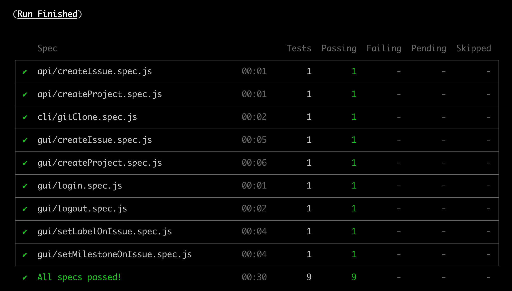

# cypress-intermediate-course

An [intermediate course of test automation with Cypress](https://www.udemy.com/course/test-automation-with-cypress-intermediate/) from the Talking About Testing school.

## Classes list

- [Class 1 - Local environment setup with Docker](#class-1-local-environment-setup-with-docker)
- [Class 2 - Test's project setup with Cypress](#class-2-tests-project-setup-with-cypress)
- [Class 3 - Simple GUI tests](#class-3-simple-gui-tests)
- [Class 4 - Intermediate GUI tests](#class-4-intermediate-gui-tests)
- [Class 5 - API testing](#class-5-api-testing)
- [Class 6 - Optimizing GUI tests](#class-6-optimizing-gui-tests)
- [Class 7 - Tests with many pre-conditions](#class-7-tests-with-many-pre-conditions)
- [Class 8 - Executing commands at the system level](#class-8-executing-commands-at-the-system-level)
- [Class 9 - Running all tests](#class-9-running-all-tests)
- [Turning off the container](#turning-off-the-container)

## Class 1 - Local environment setup with Docker

Run the command `docker run --publish 80:80 --publish 22:22 --hostname localhost wlsf82/gitlab-ce` and wait for the environment to initialize (this can take a few minutes), then access the following URL http://localhost/ to define the `root` user password.

### Creating an Access Token

1. Log in with the `root` user using the password defined in the previous section
2. Click on the user avatar in the upright corner of the screen, click the Settings link, and then, in the left side menu, click the Access Token option
3. On the name field, type the value `cypress-intermediate-course`, on the Scopes section check the 'api' option, and then click the 'Create personal access token' button

> A message that the token was successfully created should be shown, and the token itself. Copy the token by clicking the button in the right of the field and store it to use in class 2.

### Adding an SSH key

1. In the terminal, type the following command and press RETURN `ssh-keygen -t ed25519 -C "root@example.com"`
2. You will be prompted for the path to save the key. Press RETURN to accept the default path
3. You will be prompted for a password. Press RETURN so that the password will not be needed
4. You will be prompted to repeat the password. Press RETURN again so that the password will not be needed
5. In the terminal, type the following command and press RETURN to copy the just created public key to the clipboard `pbcopy < ~/.ssh/id_ed25519.pub`
6. Logged into the application with the `root` user, click on the user avatar in the upright corner of the screen, click the Settings link, and then, in the left side menu, click the SSH Keys option
7. Paste the public SSH key into the key field. The Title field should be automatically filled
8. Finally, click the 'Add key' button

> You will also find the instructions about how to set up the SSH key on a Windows operating system in the application under test itself by following this URL http://localhost/help/ssh/README#generating-a-new-ssh-key-pair.

## Class 2 - Test's project setup with Cypress

### Cloning the project

1. Access the following URL https://gitlab.com/wlsf82/cypress-intermediate-course
2. Click the 'Clone' button
3. Choose one of the options (Clone with SSH or Clone with HTTPS), and then click the 'Copy URL' button beside the field of the chosen option
4. In the terminal, in the directory where you have your software projects, type `git clone [URL copied in the previous step]` and press RETURN
5. Finally, access the directory of the just cloned project (`cd cypress-intermediate-course`)

### Initializing NPM

In the terminal, inside the directory `cypress-intermediate-course`, run the following command `npm init -y` (this command will create the `package.json` file in the project root path.)

### Initializing the `.gitignore` file

On the same directory, create a file called `.gitignore` with the following content:

```.gitignore
.DS_Store
cypress.env.json
cypress/screenshots/
cypress/videos/
node_modules/
temp/
```

### Creating the `temp/` directory

On the project root directory, create a directory called `temp/`. This directory will be used later for the git clone test.

### Installing Cypress

In the terminal, on the project root path, run the following command `npm i cypress -D` (this command will install Cypress as a dev dependency, and it will create the `package-lock.json` file, and the `node_modules/` directory)

### Initializing Cypress

In the terminal, on the project root path, run the following command `npx cypress open` (this command will open Cypress in interactive mode, and it will create the initial structure for the automated tests.)

#### Configuring the test automation project

1. Close the Cypress Electron application
2. Open the `cypress.json` file that is located in the project root path and change its content by the following:

```json
{
    "baseUrl": "http://localhost/"
}
```

3. Still on the project root path, create a file called `cypress.env.json` with the following content:

```json
{
    "user_name": "root",
    "user_password": "password-from-the-root-user-defined-previously",
    "gitlab_access_token": "access-token-create-previously"
}
```

4. Finally, inside the directory `cypress/integration/`, delete the `examples/` directory

## Class 3 -  Simple GUI tests

### Testing the login functionality

1. Inside the `cypress/integration/` directory, create a new directory called `gui/` (graphical user interface)
2. Inside the `cypress/integration/gui/` directory, create a file called `login.spec.js` with the following content:

```js
describe('Login', () => {
  it('successfully', () => {
    cy.login()

    cy.get('.qa-user-avatar').should('exist')
  })
})
```

3. Inside the `cypress/support/` directory, rename the `commands.js` file as `gui_commands.js` and change its content by the following:

```js
Cypress.Commands.add('login', () => {
  cy.visit('users/sign_in')

  cy.get("[data-qa-selector='login_field']").type(Cypress.env('user_name'))
  cy.get("[data-qa-selector='password_field']").type(Cypress.env('user_password'))
  cy.get("[data-qa-selector='sign_in_button']").click()
})
```

4. Inside the `cypress/support/` directory, change the content of the `index.js` file by the following:

```js
import './gui_commands'
```

5. Finally, in the terminal, on the project root path, run the following command `npx cypress run` to run the new test in headless mode

### Testing the logout functionality

1. Inside the `cypress/integration/gui/` directory, create a file called `logout.spec.js` with the following content:

```js
describe('Logout', () => {
  beforeEach(() => cy.login())

  it('successfully', () => {
    cy.logout()

    cy.url().should('be.equal', `${Cypress.config('baseUrl')}users/sign_in`)
  })
})
```

2. Inside the `cypress/support/` directory, update the `gui_commands.js` file with the `logout` command, as shown below:

```js
Cypress.Commands.add('login', () => {
  ...
})

Cypress.Commands.add('logout', () => {
  cy.get('.qa-user-avatar').click()
  cy.contains('Sign out').click()
})
```

3. Finally, in the terminal, on the project root path, run the following command `npx cypress run --spec cypress/integration/gui/logout.spec.js` to run the new test in headless mode

### Testing the project creation functionality

1. For the project creation test, we will use the `faker` library, which will help us with the creation of random data. In the terminal, on the project root path, run the following command `npm i faker -D` (this command will install the `faker` library as a dev dependency)
2. Inside the `cypress/integration/gui/` directory, create a file called `createProject.spec.js` with the following content:

```js
const faker = require('faker')

describe('Create Project', () => {
  beforeEach(() => cy.login())

  it('successfully', () => {
    const project = {
      name: `project-${faker.random.uuid()}`,
      description: faker.random.words(5)
    }

    cy.gui_createProject(project)

    cy.url().should('be.equal', `${Cypress.config('baseUrl')}${Cypress.env('user_name')}/${project.name}`)
    cy.contains(project.name).should('be.visible')
    cy.contains(project.description).should('be.visible')
  })
})
```

3. Inside the `cypress/support/` directory, update the `gui_commands.js` file with the `gui_createProject` command, as shown below:

```js
Cypress.Commands.add('login', () => {
  ...
})

Cypress.Commands.add('logout', () => {
  ...
})

Cypress.Commands.add('gui_createProject', project => {
  cy.visit('projects/new')

  cy.get('#project_name').type(project.name)
  cy.get('#project_description').type(project.description)
  cy.get('.qa-initialize-with-readme-checkbox').check()
  cy.contains('Create project').click()
})
```

4. Finally, in the terminal, on the project root path, run the following command `npx cypress run --spec cypress/integration/gui/createProject.spec.js` to run the new test in headless mode

## Class 4 - Intermediate GUI tests

### Testing the issue creation functionality

1. Inside the `cypress/integration/gui/` directory, create a file called `createIssue.spec.js` with the following content:

```js
const faker = require('faker')

describe('Create Issue', () => {
  const issue = {
    title: `issue-${faker.random.uuid()}`,
    description: faker.random.words(3),
    project: {
      name: `project-${faker.random.uuid()}`,
      description: faker.random.words(5)
    }
  }

  beforeEach(() => {
    cy.login()
    cy.gui_createProject(issue.project)
  })

  it('successfully', () => {
    cy.gui_createIssue(issue)

    cy.get('.issue-details')
      .should('contain', issue.title)
      .and('contain', issue.description)
  })
})
```

3. Inside the `cypress/support/` directory, update the `gui_commands.js` file with the `gui_createIssue` command, as shown below:

```js
Cypress.Commands.add('login', () => {
  ...
})

Cypress.Commands.add('logout', () => {
  ...
})

Cypress.Commands.add('gui_createProject', project => {
  ...
})

Cypress.Commands.add('gui_createIssue', issue => {
  cy.visit(`${Cypress.env('user_name')}/${issue.project.name}/issues/new`)

  cy.get('.qa-issuable-form-title').type(issue.title)
  cy.get('.qa-issuable-form-description').type(issue.description)
  cy.contains('Submit issue').click()
})
```

4. Finally, in the terminal, on the project root path, run the following command `npx cypress run --spec cypress/integration/gui/createIssue.spec.js` to run the new test in headless mode

## Class 5 - API testing

### Testing the project creation functionality

1. Inside the `cypress/integration/` directory, create a new directory called `api/` (application programming interface)
2. Inside the `cypress/integration/api/` directory, create a file called `createProject.spec.js` with the following content:

```js
const faker = require('faker')

describe('Create Project', () => {
  it('successfully', () => {
    const project = {
      name: `project-${faker.random.uuid()}`,
      description: faker.random.words(5)
    }

    cy.api_createProject(project)
      .then(response => {
        expect(response.status).to.equal(201)
        expect(response.body.name).to.equal(project.name)
        expect(response.body.description).to.equal(project.description)
      })
  })
})
```

3. Inside the `cypress/support/` directory, create a file called `api_commands.js`, with the following content:

```js
const accessToken = Cypress.env('gitlab_access_token')

Cypress.Commands.add('api_createProject', project => {
  cy.request({
    method: 'POST',
    url: `/api/v4/projects/?private_token=${accessToken}`,
    body: {
      name: project.name,
      description: project.description,
      initialize_with_readme: true
    }
  })
})
```

4. Inside the `cypress/support/` directory, add to the `index.js` file the import of the `api_commands.js` file, as shown below:

```js
import './api_commands'
import './gui_commands'
```

5. Finally, in the terminal, on the project root path, run the following command `npx cypress run --spec cypress/integration/api/createProject.spec.js` to run the new test in headless mode.

### Testing the issue creation functionality

1. Inside the `cypress/integration/api/` directory, create a file called `createIssue.spec.js` with the following content:

```js
const faker = require('faker')

describe('Create issue', () => {
  it('successfully', () => {
    const issue = {
      title: `issue-${faker.random.uuid()}`,
      description: faker.random.words(3),
      project: {
        name: `project-${faker.random.uuid()}`,
        description: faker.random.words(5)
      }
    }

    cy.api_createIssue(issue)
      .then(response => {
        expect(response.status).to.equal(201)
        expect(response.body.title).to.equal(issue.title)
        expect(response.body.description).to.equal(issue.description)
      })
  })
})
```

2. Inside the `cypress/support/` directory, update the `api_commands.js` file with the `api_createIssue` command, as shown below:

```js
const accessToken = Cypress.env('gitlab_access_token')

Cypress.Commands.add('api_createProject', project => {
  ...
})

Cypress.Commands.add('api_createIssue', issue => {
  cy.api_createProject(issue.project)
    .then(response => {
      cy.request({
        method: 'POST',
        url: `/api/v4/projects/${response.body.id}/issues?private_token=${accessToken}`,
        body: {
          title: issue.title,
          description: issue.description
        }
      })
  })
})
```

3. Finally, in the terminal, on the project root path, run the following command `npx cypress run --spec cypress/integration/api/createIssue.spec.js` to run the new test in headless mode

## Class 6 - Optimizing GUI tests

1. In the `cypress/integration/gui/createIssue.spec.js` file, replace the command `cy.gui_createProject(issue.project)` by `cy.api_createProject(issue.project)`. This way, instead of creating the project via GUI, we will create it via API, which is a faster way of doing that, and which also makes the test more independent.
2. Finally, in the terminal, on the project root path, run the following command `npx cypress run --spec cypress/integration/gui/createIssue.spec.js` to run the refactored test in headless mode.

## Class 7 - Tests with many pre-conditions

### Testing the addition of a label on an issue

1. In the `cypress/integration/gui/` directory, create a file called `setLabelOnIssue.spec.js` with the following content:

```js
const faker = require('faker')

describe('Set label on issue', () => {
  const issue = {
    title: `issue-${faker.random.uuid()}`,
    description: faker.random.words(3),
    project: {
      name: `project-${faker.random.uuid()}`,
      description: faker.random.words(5),
      label: {
        name: `label-${faker.random.word()}`,
        color: '#ffaabb'
      }
    }
  }

  beforeEach(() => {
    cy.login()
    cy.api_createIssue(issue)
      .then(response => {
        cy.api_createLabel(response.body.project_id, issue.project.label)
        cy.visit(`${Cypress.env('user_name')}/${issue.project.name}/issues/${response.body.iid}`)
      })
  })

  it('successfully', () => {
    cy.gui_setLabelOnIssue(issue.project.label)

    cy.get('.qa-labels-block').should('contain', issue.project.label.name)
    cy.get('.qa-labels-block span')
      .should('have.attr', 'style', `background-color: ${issue.project.label.color}; color: #333333;`)
  })
})
```

2. In the `cypress/support/` directory, update the `api_commands.js` file with the `api_createLabel` command, as shown below:

```js
const accessToken = Cypress.env('gitlab_access_token')

Cypress.Commands.add('api_createProject', project => {
  ...
})

Cypress.Commands.add('api_createIssue', issue => {
  ...
})

Cypress.Commands.add('api_createLabel', (projectId, label) => {
  cy.request({
    method: 'POST',
    url: `/api/v4/projects/${projectId}/labels?private_token=${accessToken}`,
    body: {
      name: label.name,
      color: label.color
    }
  })
})
```

3. In the `cypress/support/` directory, update the `gui_commands.js` file with the `gui_setLabelOnIssue` command, as shown below:

```js
Cypress.Commands.add('login', () => {
  ...
})

Cypress.Commands.add('logout', () => {
  ...
})

Cypress.Commands.add('gui_createProject', project => {
  ...
})

Cypress.Commands.add('gui_createIssue', issue => {
  ...
})

Cypress.Commands.add('gui_setLabelOnIssue', label => {
  cy.get('.qa-edit-link-labels').click()
  cy.contains(label.name).click()
  cy.get('body').click()
})
```

4. Finally, in the terminal, on the project root path, run the following command `npx cypress run --spec cypress/integration/gui/setLabelOnIssue.spec.js` to run the new test in headless mode

### Testing the addition of a milestone to an issue

1. In the `cypress/integration/gui/` directory, create a file called `setMilestoneOnIssue.spec.js` with the following content:

```js
const faker = require('faker')

describe('Set milestone on issue', () => {
  const issue = {
    title: `issue-${faker.random.uuid()}`,
    description: faker.random.words(3),
    project: {
      name: `project-${faker.random.uuid()}`,
      description: faker.random.words(5),
      milestone: {
        title: `milestone-${faker.random.word()}`
      }
    }
  }

  beforeEach(() => {
    cy.login()
    cy.api_createIssue(issue)
      .then(response => {
        cy.api_createMilestone(response.body.project_id, issue.project.milestone)
        cy.visit(`${Cypress.env('user_name')}/${issue.project.name}/issues/${response.body.iid}`)
      })
  })

  it('successfully', () => {
    cy.gui_setMilestoneOnIssue(issue.project.milestone)

    cy.get('.block.milestone').should('contain', issue.project.milestone.title)
  })
})
```

2. Inside the `cypress/support/` directory, update the `api_commands.js` file with the `api_createMilestone` command, as shown below:

```js
const accessToken = Cypress.env('gitlab_access_token')

Cypress.Commands.add('api_createProject', project => {
  ...
})

Cypress.Commands.add('api_createIssue', issue => {
  ...
})

Cypress.Commands.add('api_createLabel', (projectId, label) => {
  ...
})

Cypress.Commands.add('api_createMilestone', (projectId, milestone) => {
  cy.request({
    method: 'POST',
    url: `/api/v4/projects/${projectId}/milestones?private_token=${accessToken}`,
    body: { title: milestone.title }
  })
})
```

3. Inside the `cypress/support/` directory, update the `gui_commands.js` file with the `gui_setMilestoneOnIssue` command, as shown below:

```js
Cypress.Commands.add('login', () => {
  ...
})

Cypress.Commands.add('logout', () => {
  ...
})

Cypress.Commands.add('gui_createProject', project => {
  ...
})

Cypress.Commands.add('gui_createIssue', issue => {
  ...
})

Cypress.Commands.add('gui_setLabelOnIssue', label => {
  ...
})

Cypress.Commands.add('gui_setMilestoneOnIssue', milestone => {
  cy.get('.block.milestone .edit-link').click()
  cy.contains(milestone.title).click()
})
```

4. Finally, in the terminal, on the project root path, run the following command `npx cypress run --spec cypress/integration/gui/setMilestoneOnIssue.spec.js` to run the new test in headless mode

## Class 8 - Executing commands at the system level

### Testing the git clone functionality

1. Inside the `cypress/integration/` directory, create a new directory called `cli/` (command line interface)
2. Inside the `cypress/integration/cli/` directory, create a file called `gitClone.spec.js` with the following content:

```js
const faker = require('faker')

describe('git clone', () => {
  const project = {
    name: `project-${faker.random.uuid()}`,
    description: faker.random.words(5)
  }

  beforeEach(() => cy.api_createProject(project))

  it('successfully', () => {
    cy.cloneViaSSH(project)

    cy.readFile(`temp/${project.name}/README.md`)
      .should('contain', `# ${project.name}`)
      .and('contain', project.description)
  })
})
```

3. Inside the `cypress/support/` directory, create a file called `cli_commands.js` with the following content:

```js
Cypress.Commands.add('cloneViaSSH', project => {
  const domain = Cypress.config('baseUrl').replace('http://', '').replace('/', '')

  cy.exec(`cd temp/ && git clone git@${domain}:${Cypress.env('user_name')}/${project.name}.git`)
})
```

4. Inside the `cypress/support/` directory, add to the `index.js` file the import of the `cli_commands.js` file, as shown below:

```js
import './api_commands'
import './cli_commands'
import './gui_commands'
```

5. Finally, in the terminal, on the project root path, run the following command `npx cypress run --spec cypress/integration/cli/gitClone.spec.js` to run the new test in headless mode

> Note: In the first time you run the test you will be prompted the following: `Are you sure you want to continue connecting (yes/no)?` Answer `yes` and press RETURN.

> Note 2: In case the test fails with the below error, run the following command `ssh-keygen -R localhost`, press RETURN, and then re-run the test (`npx cypress run --spec cypress/integration/cli/gitClone.spec.js`).

```sh
CypressError: cy.exec('cd temp/ && git clone git@localhost:root/project-8074da23-f979-4555-84e8-7a63fb69a326.git') failed because the command exited with a non-zero code.

Pass {failOnNonZeroExit: false} to ignore exit code failures.

Information about the failure:
Code: 128

Stderr:
Cloning into 'project-8074da23-f979-4555-84e8-7a63fb69a326'...
@@@@@@@@@@@@@@@@@@@@@@@@@@@@@@@@@@@@@@@@@@@@@@@@@@@@@@@@@@@
@    WARNING: REMOTE HOST IDENTIFICATION HAS CHANGED!     @
@@@@@@@@@@@@...
      at Object.cypressErr (http://localhost/__cypress/runner/cypress_runner.js:106136:11)
      at Object.throwErr (http://localhost/__cypress/runner/cypress_runner.js:106091:18)
      at Object.throwErrByPath (http://localhost/__cypress/runner/cypress_runner.js:106123:17)
      at http://localhost/__cypress/runner/cypress_runner.js:90175:23
      at tryCatcher (http://localhost/__cypress/runner/cypress_runner.js:140400:23)
      at Promise._settlePromiseFromHandler (http://localhost/__cypress/runner/cypress_runner.js:138336:31)
      at Promise._settlePromise (http://localhost/__cypress/runner/cypress_runner.js:138393:18)
      at Promise._settlePromise0 (http://localhost/__cypress/runner/cypress_runner.js:138438:10)
      at Promise._settlePromises (http://localhost/__cypress/runner/cypress_runner.js:138517:18)
      at Async../node_modules/bluebird/js/release/async.js.Async._drainQueue (http://localhost/__cypress/runner/cypress_runner.js:135125:16)
      at Async../node_modules/bluebird/js/release/async.js.Async._drainQueues (http://localhost/__cypress/runner/cypress_runner.js:135135:10)
      at Async.drainQueues (http://localhost/__cypress/runner/cypress_runner.js:135009:14)
```

## Class 9 -  Running all tests

### Headless mode

1. Open the `package.json` file located on the project root path
2. On the `scripts` section, change the value of the `test` script by the following `cypress run`

The `scripts` section of the `package.json` file should look like this:

```json
"scripts": {
  "test": "cypress run"
},
```

3. Finally, in the terminal, on the project root path, run the `npm test` command to run all tests in headless mode. You should obtain a result similar to what is shown in the below image.



### Interactive mode

1. In the terminal, on the project root path, run the following command `npx cypress open` (this command will open the Cypress Electron application)
2. To run all tests in interactive mode, click the 'Run all specs' button. Or, to run a specific test, click in the test you want to run from the tests' list.

## Congratulations, you reached the end of the course!

### Turning off the container

1. In the terminal, run the following command `docker container ls`, press RETURN, and copy the `CONTAINER ID` that refers to the `wlsf82/gitlab-ce` image
2. Finally, execute the command `docker container stop [CONTAINER ID copied in the previous step]` and press RETURN

> Note: After turning off the container, in case you want to start the application again, [follow the steps described on class 1](#class-1-local-environment-setup-with-docker), and **remember to update the values from the `cypress.env.json` file**, as described on class 2, [step 3](#configuring-the-test-automation-project)
___

Made with 💚 by [Walmyr Filho](https://twitter.com/walmyrlimaesilv)
